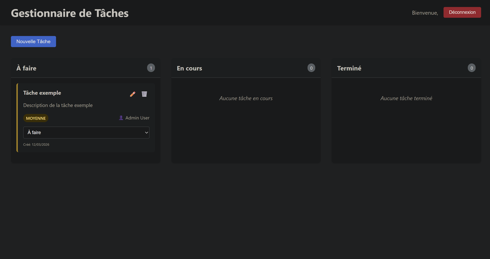
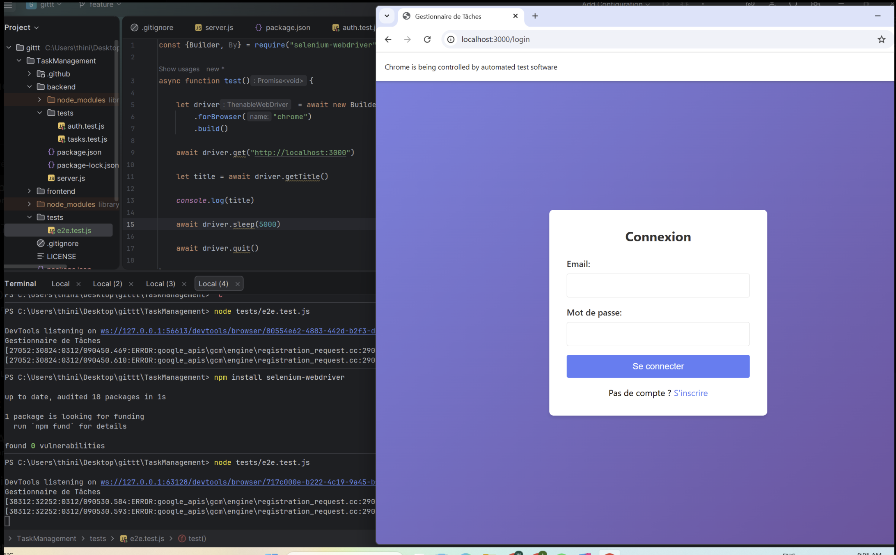
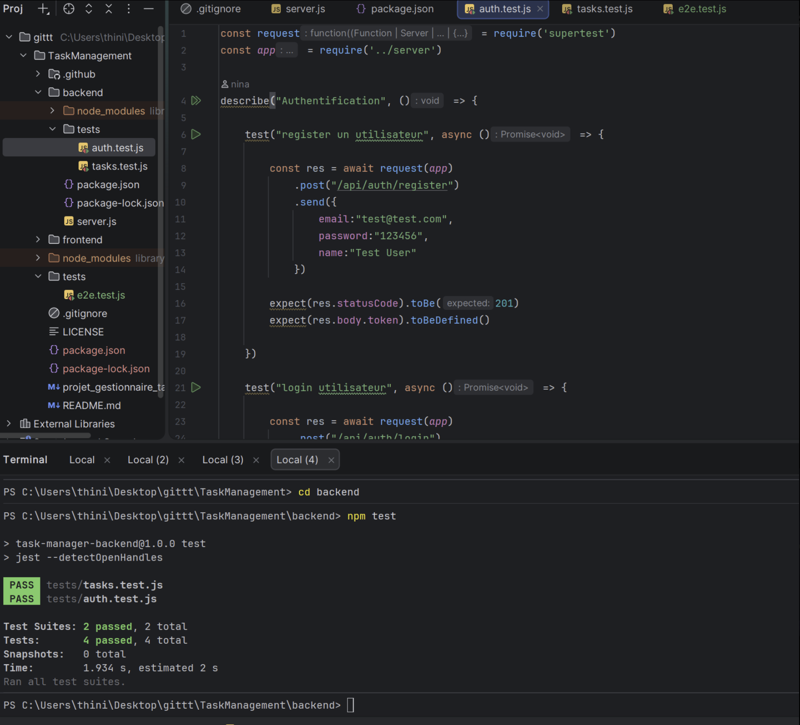

# taskmanagement
Application de gestion de tâches

Nous avons d'abord créer le Repo git et ajouter les collaborateurs de notre groupe. Nous avons ensuite créer les branches et assigner les règles à ces différentes branches en fonction de leurs importances.
Par exemple pour la branche main :
-Require a pull request before merging
-Require approvals = 1 (ou 2 si vous voulez)
-Dismiss stale pull request approvals when new commits are pushed
-Require status checks to pass before merging
-Require branches to be up to date before merging
-Require conversation resolution before merging
-Block force pushes
-Block deletions

Nous avons aussi lancer l'application après avoir exécuter ces commandes :
cd backend
npm install
npm run dev
Pour voir si tout fonctionnait et appliquer les modifications nécessaires à ce bon fonctionnement.

## Améliorations DevOps et Qualité du Code

Afin de faciliter le développement et garantir la stabilité du code, nous avons mis en place plusieurs outils d'automatisation.

### 1. Installation et Lancement Simplifiés

**Démarrage "Tout-en-un" :**
Pour installer toutes les dépendances, configurer les hooks Git (Husky) et lancer les serveurs en une seule commande :
```bash
npm run all
```

**Lancement quotidien (si déjà installé) :**
Pour simplement démarrer les serveurs :
```bash
npm start
```

### 2. Pipeline de Qualité (Git Hooks)
Nous avons configuré **ESLint**, **Husky** et **lint-staged** pour empêcher l'envoi de code incorrect.

*   **Configuration :** Des règles ESLint spécifiques ont été définies pour le Backend (Node.js) et le Frontend (React).
*   **Automatisation :** À chaque `git commit`, un hook vérifie uniquement les fichiers modifiés.
*   **Correction automatique :** Les erreurs de style simples sont corrigées automatiquement (`--fix`) avant le commit.

---

Nous avons vérifié le bon fonctionnement de l'application :
!alt text

Nous avons ensuite créer des tests unitaires pour l'intégration et les e2e.




